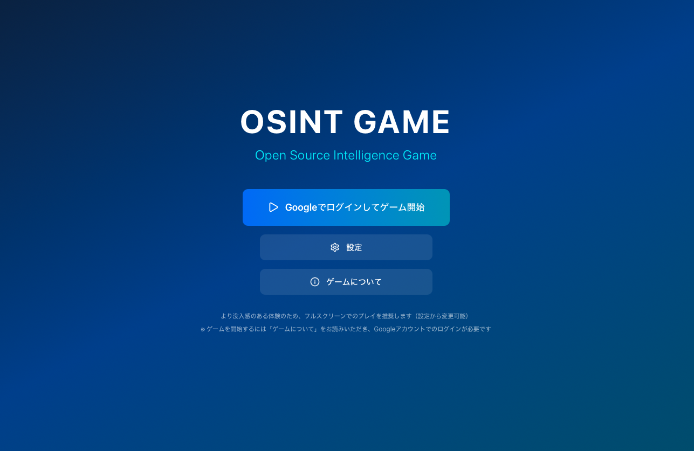

# OSINT GAME


[デモサイト](https://osint-game.vercel.app/)と[ゲームクリア後の解説動画](https://youtu.be/DZABwppGMG8)を公開しています。

ぜひ、OSINTの世界を体験してみてください！

※本サイトは予告なくサービスを停止する場合があります。
また、サーバーの不調によりエラーが生じる場合がございますので、その際はお手数ですが一度ブラウザのリロードをお試しください。

## 目次
- [OSINT GAME](#osint-game)
  - [目次](#目次)
  - [OSINT GAMEとは](#osint-gameとは)
    - [OSINTとソーシャルエンジニアリングの脅威](#osintとソーシャルエンジニアリングの脅威)
    - [現在の問題点とOSINT GAMEのコンセプト](#現在の問題点とosint-gameのコンセプト)
  - [シナリオ紹介: SNSを活用したOSINTとスピアフィッシング](#シナリオ紹介-snsを活用したosintとスピアフィッシング)
  - [今後の展望](#今後の展望)
  - [リポジトリ構成](#リポジトリ構成)
  - [構成技術](#構成技術)
    - [使用技術](#使用技術)
    - [アーキテクチャ](#アーキテクチャ)
  - [Contributing](#contributing)
  - [License](#license)
  - [審査基準について](#審査基準について)
    - [要件](#要件)
    - [新規性](#新規性)
    - [実現性](#実現性)
    - [継続性](#継続性)
    - [貢献](#貢献)

## OSINT GAMEとは
OSINT GAMEは、サイバー攻撃者の視点に立ってOSINT（Open Source Intelligence）を体験できる、没入型のシミュレーションゲームです。

公開情報から個人や組織の情報がどのように特定され、悪用されるのか。そのリスクと社会的影響を、初心者でも直感的に理解できるゲーム形式で学べます。本作は複数のシナリオで構成されており、それぞれ特定の学習テーマに沿ってOSINTのスキルを磨くことができます。

> このツールは`MWSCup 2025 ハッカソン課題`として`UN頼み`が作成しました。

### OSINTとソーシャルエンジニアリングの脅威
技術による防御が高度化する一方で、サイバー攻撃の矛先はシステムの脆弱性から人間の油断や善意に向けられています。
[Verizon 2025 Data Breach Investigations Report](https://www.verizon.com/business/resources/infographics/2025-dbir-smb-snapshot.pdf)によると、データ漏洩および侵害の要因の過半数は人的要因だと言われています。
また、[Acronis サイバー脅威レポート 2025 年上半期版](https://www.acronis.com/ja-jp/resource-center/resource/acronis-cyberthreats-report-h1-2025/)によると、メール攻撃において、ソーシャルエンジニアリング、ビジネスメール詐欺が占める割合が2024年の20%から 2025年では、25.6%まで増加しています。
この数値は、今後AIの発展によりソーシャルエンジニアリングの精度が上がり、増加していくと考えます。

### 現在の問題点とOSINT GAMEのコンセプト
一方で、「大切な情報を守るため、SNSでの発信は慎重に。」といった防御側視点の呼びかけでは、OSINTの脅威を実感しづらいです。
そこで、攻撃者側の視点に立ってOSINTを体験し、どうやって攻撃者は情報を抜き取るのかを学習し、どうすれば大切な情報を守れるかを自発的に考えるように促すことが重要と考えます。
攻撃者視点を学ぶための手段として、OSINTを題材としたシミュレーションやゲームが挙げられます。
これらは、実際の環境ではないため危険性がなく、繰り返し試行でき、楽しみながら学べるという大きな利点を持っています。

しかし、既存のOSINTを題材としたものは、進行が選択式であるため自由度が低く、現実の調査とはかけ離れた体験になりがちです。
また、攻撃手法に関する詳細な解説も不足しているため、真の学習効果が高いとは言えません。
そこで我々が目指すのは、より実践的で教育的な体験を提供する新たな仕組みです。実際の攻撃に近いリアルなシナリオを、安全な環境で繰り返し体験できるというシミュレーションの利点を活かしつつ、利用者が楽しみながら脅威への理解を深め、自発的に防御策を講じられるようになることを目的としています。

## シナリオ紹介: SNSを活用したOSINTとスピアフィッシング
UN 頼みはシナリオの一例としてSNSを活用したOSINTとスピアフィッシングをテーマにしたものを用意しました。

ゲームを始めると、闇の組織からのメッセージが届きます。
そのメッセージに従って、「新田」という架空の人物のメールアカウントの侵害を目標として、公開情報の活用とSNSのDMによるスピアフィッシングを行います。

ゲームの流れは以下の通りです。

0. 方針の決定
1. ターゲットのメールアドレス・生年月日の特定
2. 秘密の質問の答えの特定
3. メールアカウントの侵害

一部、ゲーム内で登場する架空のサービスは現実のサービスと対応しています。
具体的な対応は以下です。
| 現実のサービス              | ゲームのサービス                  |
| ------------------------ | ------------------------------- |
| Facebook                 | Facelook                        |
| X(Twitter)               | Z                               |
| Qiita                    | Chiita                          |
| Linkedin                 | Rankedon                        |
| Google                   | Goggles                         |
| Wikipedia                | Usopedia                        |
| 朝日新聞                  | 夕日新聞                          |
| Yahoo!ニュース            | Nyahoo!ニュース                   |
| Yahoo!知恵袋              | Nyahoo!無知袋                    |
| Starbucks                | Skyducks                        |
| タリーズコーヒー            | テリーズカフェ                    |
| Weyback Machine          | Playback Machine                |

詳細な解法は[公式Writeup](./docs/writeup.pdf)を参考にして下さい。

## 今後の展望
- シナリオ追加
  - シナリオ例 1: 検索エンジンを使った基本的なOSINT
  - シナリオ例 2: 位置情報と画像を活用した行動特定
  - シナリオ例 3: ダークウェブを活用したOSINT
- 他の情報公開サービスの追加
  - 現実に存在する様々な情報公開サービスを模したサイトを追加する


## リポジトリ構成
```plaintext
/
|--- data/
|     ゲームのサンプルデータファイル
|--- docs/
|     プロジェクトのドキュメント
|--- functions/
|     Firebase Functionsのソースコード
|--- public/
|     画像などの静的ファイル
|--- scripts/
|     ゲームのサンプルデータをFirestoreにアップロードするためのスクリプトファイル
|--- src/
|     Next.jsアプリケーションのソースコード
|--- .env.local.sample
|     環境変数のサンプルファイル
|--- README.md
      プロジェクトの説明ファイル
```
## 構成技術
### 使用技術
このプロジェクトでは以下の技術を使用しています。
<p align="left">
  
  
  
  
  
</p>

### アーキテクチャ
このゲームは、Next.js + React を中心に構築されたWebゲームであり、
バックエンドには Firebase サービス群（Auth・Firestore・Storage・Functions）と外部AI APIである Google Gemini 2.5 Flashを統合しています。
ホスティングには Vercel を採用し、スケーラブルでデプロイ自動化された構成になっています。


## Contributing
このプロジェクトはどんなContributingも歓迎します。
開発方法、Contributingに関する詳細は[CONTRIBUTING](./CONTRIBUTING.md)を参照ください。

## License
このソフトウェアは、**MIT LICENSE** で提供されています。


## 審査基準について
### 要件
- 作品をインターネットで公開し、多くの人が利用、改良できる
- 作品による法令違反、権利侵害、倫理的問題はない

### 新規性
- 攻撃者視点を体験できる対話的でリアルなOSINT学習ゲーム
- 生成AIを活用しているため、決まった解法がなくリプレイ性が高い

### 実現性
- ゲーム内で参照可能な攻略手順書とGithub上に公開されている詳細なWriteupがあり、初心者でも学習できる
- リアル性が高く、没入感がありゲームとしても楽しい
- 手を動かして学ぶことができる

### 継続性
- 異なる難易度のシナリオ実装
- 他の情報公開サービスの実装

### 貢献
- リアルな体験により、効果的に公開情報から個人や組織の情報が特定されうるリスクと社会的な影響を深く認識
- 充実した解説により、教育的価値が高い